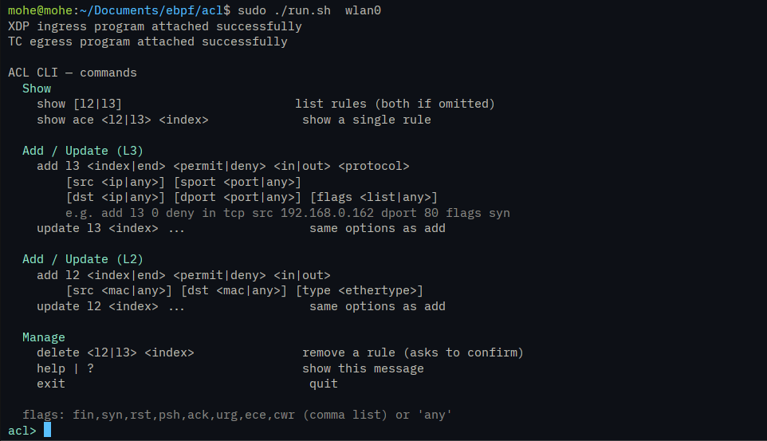
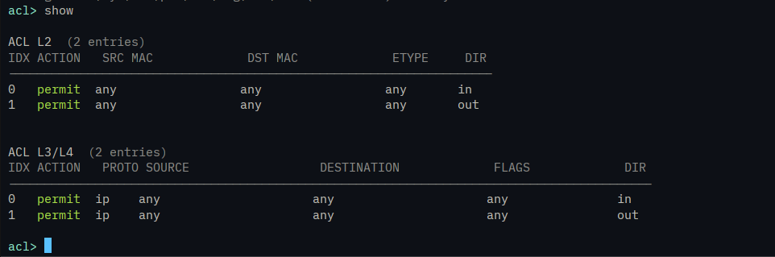
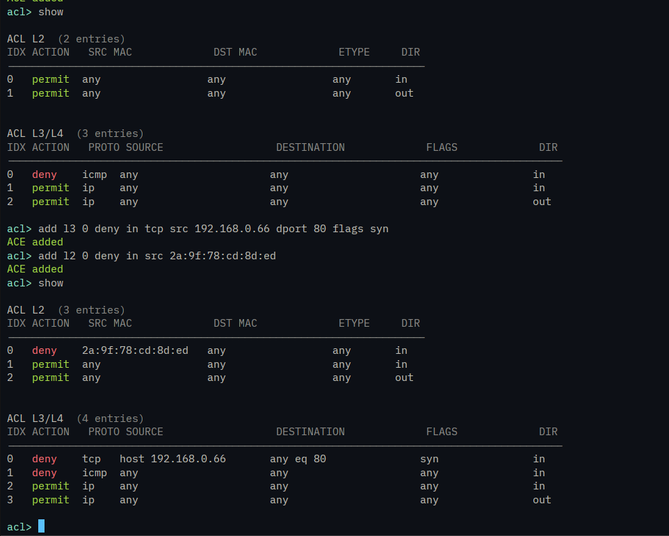
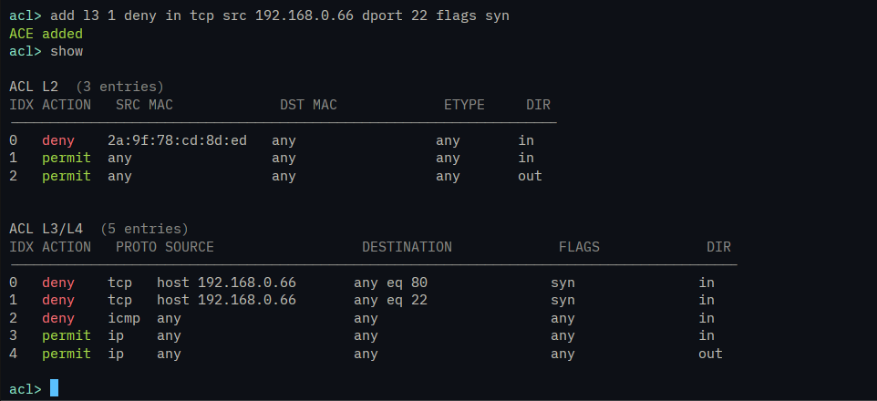
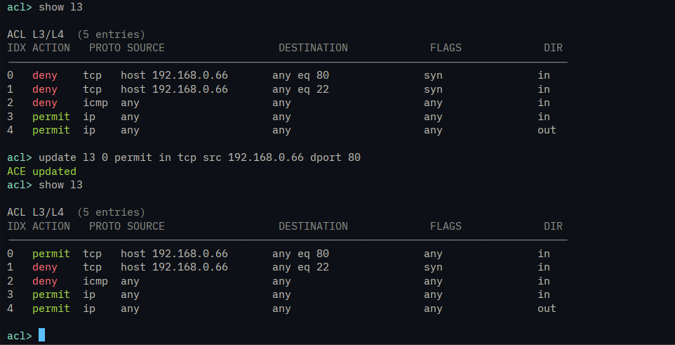
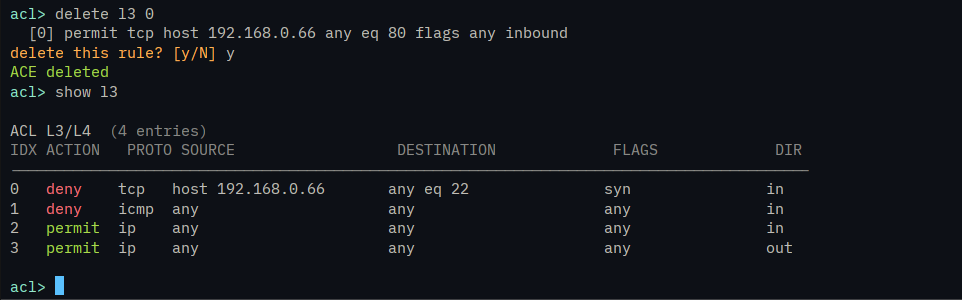
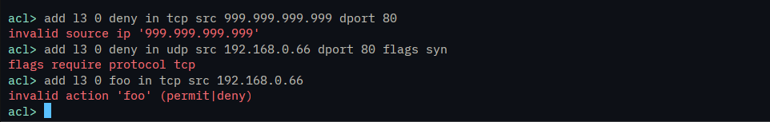

# eBPF Firewall

A stateless layer 2 and layer 3-4 access control firewall build with eBPF (XDP for ingress, TC for egress). With Cisco ACL style command-line.

## Features
- Layer 2 filtering: source/destination MAC, EtherType
- Layer 3/4 filtering: source/destination IP, protocol, source/destination port
- TCP flag matching (SYN, ACK, FIN, RST, PSH, URG, ECE, CWR). For example `flags syn` matches any packet with SYN set
- First-match-wins rule evaluation, Cisco ACL semantics (`permit`/`deny`, `in`/`out`)
- Denied packets are reported via a BPF ring buffer and logged with kernel-accurate timestamps
- Interactive CLI

## Project structure
```
acl/
├── include/    shared headers (common.h, structs, TCP flag masks)
├── src/
│   ├── kernel/
│   │   ├── packet_filter.bpf.c   eBPF program
│   │   └── vmlinux.h
│   └── user/
│       ├── acl.hpp         ACL table read/write/insert/remove/update
│       ├── loader.cpp/hpp  EbpfLoader, attach/detach, ring buffer polling
│       ├── logger.cpp/hpp  Logger, timestamped file logging
│       ├── main.cpp        interactive CLI
│       └── utils.cpp/hpp   parsing and formatting helpers
├── run.sh                run
└── acl.log               runtime deny/info/error log
```

## Build & run
```bash
./run.sh <interface>
```
This compiles the BPF object, builds the userspace loader, and attaches it to the given interface. Requires: `clang` (BPF target support), `g++` with C++23 support, `libbpf-dev`, root privileges to attach XDP/TC.

## CLI usage


### Shorthand & wildcards

You don't have to type a full value for every field the CLI accepts shortcuts wherever a value isn't required to match:

- **IP addresses** — use `any` instead of a real address to match every source/destination:
  ```
  acl> add l3 0 deny in tcp src any dport 80
  ```
  This matches TCP traffic to port 80 from **any** source IP, not just one host.

- **Ports** — same idea, use `any` instead of a number:
  ```
  acl> add l3 0 deny in tcp src 192.168.0.66 dport any
  ```
  This blocks **all** ports from that host, not just one.

- **EtherType** — you can type a raw hex value directly (e.g. `0x0806` for ARP), a keyword (`ip`, `arp`, `ipv6`), or `any`:
  ```
  acl> add l2 0 deny in src 2a:9f:78:cd:8d:ed type 0x0806
  acl> add l2 0 deny in src 2a:9f:78:cd:8d:ed type arp
  acl> add l2 0 deny in src 2a:9f:78:cd:8d:ed type any
  ```
  All three above work — `0x0806` and `arp` mean the same thing, the raw hex form is there in case you need an EtherType with no built-in keyword.

- **MAC addresses** — same pattern, `any` matches every MAC:
  ```
  acl> add l2 0 deny in src any dst any type ip
  ```

Any field left out entirely (not typed at all) also defaults to `any` — you only need to specify the fields you actually want to filter on.

### Show

### Add


### Update

### delete

### validation


## Logs

`acl.log` records every denied packet, plus startup and error events, with a millisecond-accurate timestamp, so you can see exactly what was blocked, when, and why.

**Format:**
```
[timestamp] [LEVEL] message
```

- `INFO` — engine lifecycle (startup, interface attached)
- `DENY` — a packet was dropped by a rule
- `ERROR` — an internal problem, not a rule decision

**Sample:**
```
[2026-09-26 14:03:47.902] [DENY ] access-list ACL-L3L4 denied tcp 192.168.0.66:51422 -> 192.168.0.72:80 flags syn (ACE 0, in, dropped-at 2026-09-26 14:03:47.899)
```

Read it left to right:
- `ACL-L3L4`, matched an IP/port rule (`ACL-L2` = MAC/EtherType rule instead)
- `tcp 192.168.0.66:51422 -> 192.168.0.72:80`, who sent it, and where it was going
- `flags syn`, TCP flags on the packet (TCP only)
- `ACE 0`, the rule index that matched (`implicit-deny` = no rule matched, blocked by default)
- `in` / `out`, inbound or outbound traffic
- `dropped-at`, the exact kernel-side drop time

Watch it live:
```bash
tail -f acl.log
```
